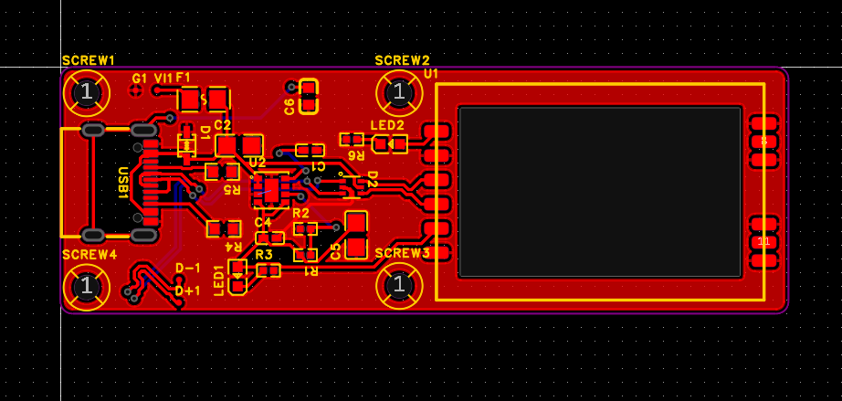
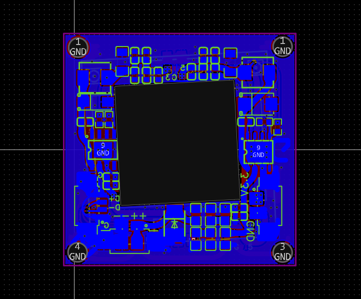

# OpenEyePC FPV

# July 20'th 
Project inception:
Goals for this project:
- make a good digital FPV system for UAVs 
	- that's cheap
	- reliable
	- reletively long range
	- ISM bands
	- works

so I decided to use cheap IP cameras with custom OpenIPC firmware and custom PCB backboards to add wireless adapters.

This took some research, I initally came across it while making my FlyQ fixed wing, I found it i quite interesting when i first came across it.

## Why OpenIPC?
OpenIPC stood out to me because it's flexible, open-source, and has a surprisingly active community. Most people use it for home security setups, but the idea of using it for airborne FPV was too tempting.

These cheap IP cameras (often based on HiSilicon or XM chips) have decent imaging hardware for the price and with OpenIPC, you unlock full control over streaming, resolution, bitrate, and more. Combine that with some basic Linux tinkering, and suddenly you have a DIY digital FPV system. I wasn't the first to invent this, they already are working on firmware, I talked with some involved in with the community directly to get some more idea.

## Why? 
While researching for my drone project, I came across various FPV system, some analog, some digital, some cheap, some rather expensive. I had initially choosen an Analog FPV system, a Runcam cycling camera (lol) with a speedybee VTX, but I want something with superior range and customizable.

time spent: 3 hours

# July 21'st
Working more on this, this system will have the these minimum technical capabilities:
- Camera
	- Camera Sensor: IMX415 (as heard from the community)
	- Minimum resolution: 1080p 
	- Min. FPS: 30
	- Latency: sub 100 ms
	- Chip: SSC338Q (also recommended by devs)
- Ground Station
	- Fast H.264 decode
	- MIMO Antenna capabilities for better reception

Based on this, let's refine and make this work.

For the Camera, I have choosen a IP camera module I found on aliexpress which falls within the criteria of selection, it's actually great, cheaper than most since I am buying a mass produced IP camera module without even the housing. 
This camera would be connected to a daughter board that'd connect it with the wifi module and power it all.

For the Groundstation,, I will use a custom PCB capable of being plugged into a phone that would recognize it as a wifi adaptor and with PixelPilot work as a FPV monitor!

Camera:

This is a SigmaMaster SSC338Q IMX415 Module for the camera.

For the Camera, it'll use a IMX415 sensor as mentioned.

I read through the spec sheet for the SSC338Q chip and it's kinda awesome, it can do a lot and is prefect indeed. If you want to take a look, [you can](https://www.sigmastarsemi.com/uploadfile/file/20220419/20220419031720_62035.pdf).

For the lens, it'll use a 3.6 mm lens, which I feel would be ok for this purpose.

For the Airside tx, I am thinking of using a this BL-M8812EU2 from LB Link, which is based on the RTL8812EU module, it's a great module because it supports upto 29 dBm of output power while being very cheap (~$10)

I'd need to make a custom PCB to house this board and all the components that'll be required to power it (and the camera). Will probably add a heatsink to cool it down.

For the Groundstation side, I'll just use a LB-LINK BL-R8812AF1 board on a custom pcb to connect with a phone to interface with Pixelpilot. Also reletively cheap at around ~$10

This is based on the RTL8812AU, an old chip that's time tested.

time spent: 4 hours

# July 22'nd
Good afternoon, let's just make a block diagram of the GS side to see how things would be placed and interact.

#### Component functions:
- antenna: to recieve the signals from the UAV transmitter
- BL-R8812AF1: capable network module
- custom board: to hold everything together and power the network module from OTG Power
- Mobile device, the decoding device and monitor

#### Technical Implementation
- the antennas would be one 13 dbi gain omni antenna and one panel antenna of 23 dBi, both connected to the RTL2AU module
- Decoding, it'll use PixelPilot OSS proj. for H264 decoding
- It'll be powered by the phone power, the power demand shouldn't be that much because the module would mostly be RX only.

#### PCB specific
- the pcb will power the the chip from the phone with the USB OTG power and DC step down
- ESD protection on the Data lines
- led status
- USB C connection

done! it took a bit but it's done! (ground side custom pcb done)

time spent: ~7 hour

# July 23rd
time for the airside PCB

 ### technicals:
 - it should power both the camera and the wifi module
 - it should have the connectors for both
 - house heatsink for the module
 - house fan for the module heatsink

time spent: ~7 hour

# July 24'th

Let's check through the current system, how it'll function. We're almost done, this is just a final check to make sure our systems aren't flawed by design choices we made.

### System Overview

**Airside (UAV):**
- Camera module (SSC338Q + IMX415) -> streams H.264
- WiFi module (RTL8812EU)
- Custom PCB:
  - Powers camera and WiFi module (via step-down converter from LiPo)
  - Hosts connectors and thermal management (fan + heatsink)
  - Provides stable 5V rail, ESD protection, and decoupling

**Groundside (GS):**
- USB WiFi module (RTL8812AU) in monitor mode
- Connected to mobile device via OTG
- Custom PCB:
  - Distributes OTG power
  - Antenna connections: 13 dBi omni + 23 dBi panel
- Mobile App: PixelPilot for stream decoding

### Link Budget Estimate (5 GHz, Open Air)

- TX Power (Air): 29 dBm
- TX Antennas: 2x 5 dBi
- RX Antennas: 13 dBi + 23 dBi
- Free Space Path Loss at 5 km (5.8 GHz): ~114 dB
- Expected RX Signal: ~ -43 to -55 dBm
- Sensitivity (RTL8812AU at MCS7): ~ -70 dBm

Result: Link should remain stable under clear LOS conditions.

## What remains?

### DVR
- plans: 
	- so current plan is to add a usb hub typa PCB to the USB terminals of the camera module which'd extend the USB connection to both wifi module and SD card adaptor.

