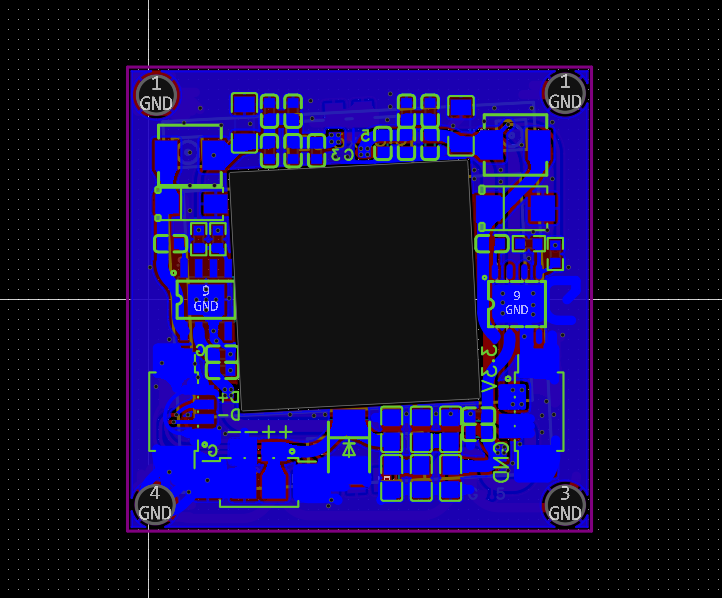
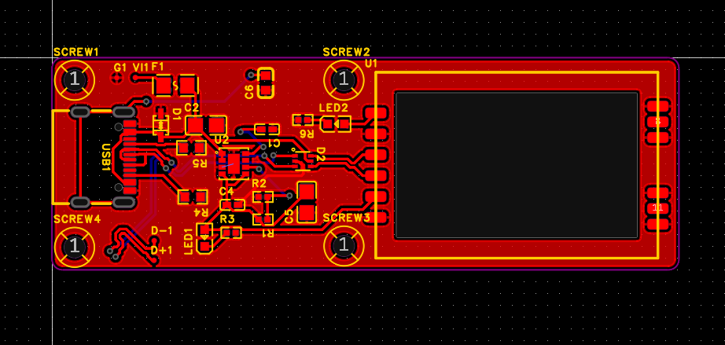
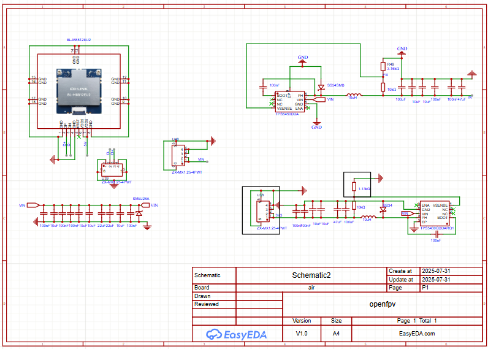
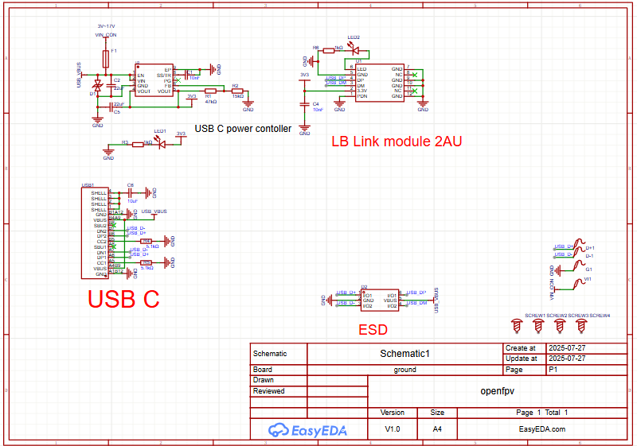

# OpenFPV
OpenFPV is a DIY digital FPV system for UAVs that leverages low-cost IP camera modules running custom OpenIPC firmware, paired with high-power WiFi adapters to stream video over long distances on the 5 GHz ISM band. This project aims to build a semi-long-range (up to ~5 km) FPV system that's modular, affordable, and hackable.

> ### In a nutshell
> So this is a system for cheap-ish cameras intended to be used for surveillance to be modded with some extra firmware and carrier boards to transmit long-ish (with other hardware like antennas and stuff) distances.
> I was initially going with making the digital FPV systems cheaper since most of those are mainly manufactured by DJI and the likes and sold at much higher costs.

> The current components of the project (in the repo), the board for the camera and receiver, should be all one would need to use the system (other than the obvious, the camera board and batteries and stuff). The camera would transmit via the boards, and the system connected at the other end would receive it via the receiver board over plain ol' wifi! all under the ISM bands! With some error correcting and bitrate correction stuff, one can get loooong ranges with it, wfg-ng is the radio link for this.
you could achieve a good range with cheap-ish antennas, and get the radio link to connect at quite a distance if it's in line of sight.

# Made for the following camera module

## Project goals

- mid range (5-6 km)
- reliable
- open source!
- cheap

## System Overview

### Airside (UAV)

| Component            | Description                                      |
|----------------------|--------------------------------------------------|
| Camera               | SSC338Q SoC + IMX415 1080p module                |
| WiFi Adapter         | BL-M8812EU2 (RTL8812EU, ~29 dBm TX power)        |
| Custom PCB           | Power regulation (LiPo to 5V), heatsink + fan    |
| Antennas             | 2× 5 dBi stubby antennas                         |
| Firmware             | OpenIPC (RTSP output)                            |

---

### Ground Station

| Component            | Description                                      |
|----------------------|--------------------------------------------------|
| WiFi Adapter         | BL-R8812AF1 (RTL8812AU)                          |
| Antennas             | 13 dBi omni + 23 dBi panel (MIMO diversity)      |
| Custom PCB           | Powered via USB OTG, ESD protection, USB-C       |
| Mobile Device        | Android phone with PixelPilot |
| Software             | H.264 decoding via PixelPilot                    |

---

# BOM

|Category   |Component                          |Qty|Unit Cost (USD)|Total Cost|link                                                  |
|-----------|-----------------------------------|---|---------------|----------|------------------------------------------------------|
|Camera     |SSC338Q + IMX415 camera module     |1  |$30.00         |$30.00    |https://www.aliexpress.com/item/1005007899575234.html |
|Antenna    |5 dBi stubby antennas (SMA)        |2  |$2.50          |$5.00     |https://www.aliexpress.com/item/1005004388721764.html |
|WiFi Module|BL-M8812EU2 (RTL8812EU)            |1  |$11.00         |$11.00    |https://www.aliexpress.com/item/1005007723850436.html |
|Cooling    |Heatsink + 5V micro fan            |1  |               |          |already have                                          |
|PCB        |Airside custom PCB                 |1  |$20.00         |$20.00    |jlcpcb + components                                   |
|           |                                   |   |               |          |                                                      |
|WiFi Module|BL-R8812AF1 (RTL8812AU)            |1  |$11.52         |$11.52    |https://www.aliexpress.com/item/1005006486060233.html |
|Antenna    |13 dBi omni + 23 dBi panel antennas|2  |$17.00 + 2     |$19.00    |https://www.aliexpress.com/item/1005005559736986.html?|
|PCB        |Groundstation custom PCB           |1  |$15.00         |$15.00    |jlcpcb + components                                   |
|           |                                   |   |               |          |                                                      |
|Misc.      |Solder, headers, standoffs, extras |   |$10.00         |$10.00    |                                                      |
|           |                                   |   |               |$121.52   |                                                      |
